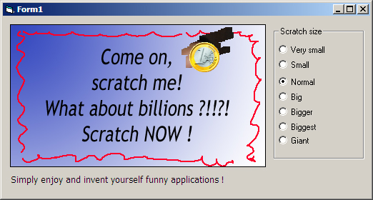



## Scratch & Win OCX

### Description

Just for add some fun to many kind of application (educational, family parties, and so on)
 
### More Info
 
Just specify the path of the Cover image, the "to be revealed image" and the size of the scratcher !

Just made in vb , with no api (only loadpicture!)

Absolutely none

             |
---                |---
**Submitted On**   |2004-12-02 15:00:04
**By**             |[Fabio La Vitola](https://github.com/Planet-Source-Code/PSCIndex/blob/master/ByAuthor/fabio-la-vitola.md)
**Level**          |Beginner
**User Rating**    |4.8 (62 globes from 13 users)
**Compatibility**  |VB 6\.0
**Category**       |[OLE/ COM/ DCOM/ Active\-X](https://github.com/Planet-Source-Code/PSCIndex/blob/master/ByCategory/ole-com-dcom-active-x__1-29.md)
**World**          |[Visual Basic](https://github.com/Planet-Source-Code/PSCIndex/blob/master/ByWorld/visual-basic.md)
**Archive File**   |[Scratch\_&\_1824311222004\.zip](https://github.com/Planet-Source-Code/fabio-la-vitola-scratch-win-ocx__1-57511/archive/master.zip)

